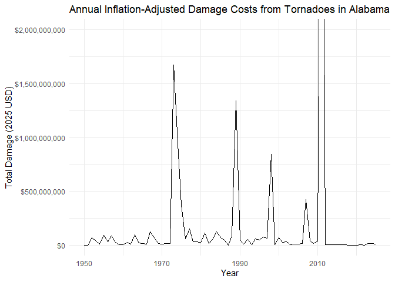
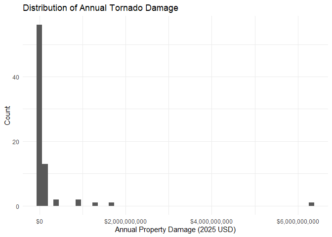
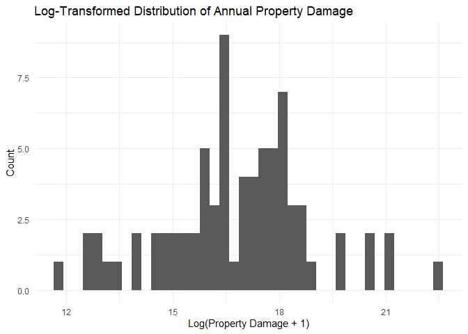
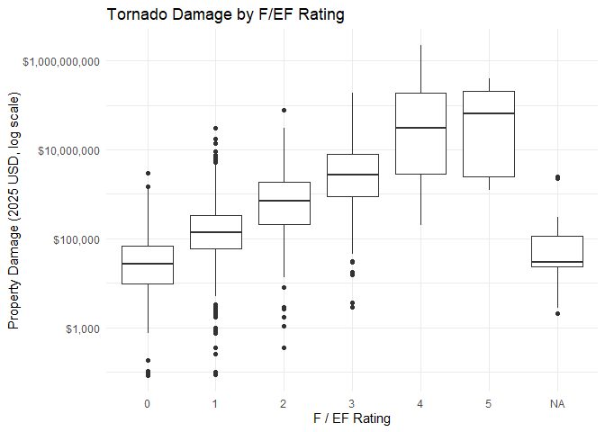
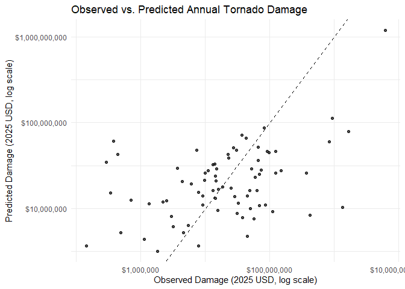
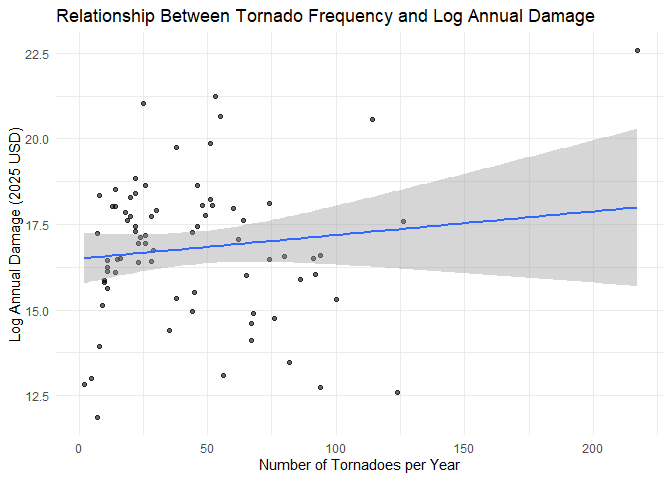
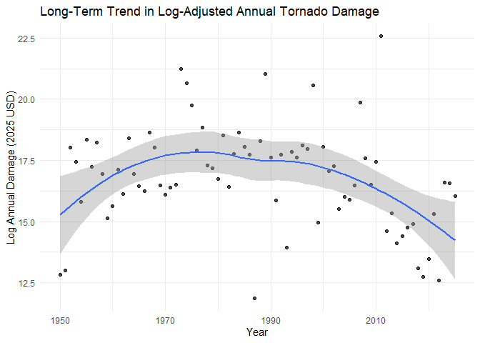

Alabama Tornado Analysis
================
Owen Widdis
2025-12-01

# Background

In 2008, while on a family trip to the Wisconsin Dells, we were forced
to take shelter in a roadside ditch to escape an oncoming tornado.
Thankfully, we emerged unharmed, but the experience left a lasting
impression on me. As I grew older, that encounter sparked an interest in
tornadoes and their effects on infrastructure, the environment, and the
lives of those in their path.

# Research Question

With growing concern about climate change and its potential impact on
storm intensity, I became interested in exploring how shifts in
atmospheric conditions have influenced tornadoes. Specifically, I wanted
to investigate whether or not there is an affect on inflation-adjusted
damage costs from tornadoes in Alabama from 1950 - 2025.

### Intensity Variables

To measure the intensity of a given storm, I considered several
variables. In 1971, Ted Fujita developed the Fujita Scale to distinguish
between weak and strong tornadoes. This scale was quickly adopted by the
meteorological community; however, long-term use revealed several
inconsistencies and inaccuracies in storm ratings. Researchers at Texas
Tech University proposed the Enhanced Fujita (EF) Scale in 2004,
building upon the original framework, which rates storms on a scale of
0-5, with 5 being the most intensive. The EF Scale uses damage
indicators and degrees of damage to estimate wind speeds, which are then
used to assign a storm’s rating. The National Weather Service officially
adopted the EF Scale in 2007.

It is important to note that the dataset used for this project (the
Storm Events Database from the National Oceanic and Atmospheric
Administration) includes both F and EF Scale ratings (F Scale:
1950–February 1, 2007; EF Scale: February 1, 2007–2025). Tornadoes that
occurred prior to the development of the Fujita Scale in 1971 were rated
retroactively using newspaper reports, eyewitness accounts, and other
available documentation describing storm impacts.

Second, I examined damage estimates from each storm across two
variables: property damage and crop damage. To account for inflation, I
used the quantmod library to access Federal Reserve Consumer Price Index
(CPI) data for each month from 1950 to 2025 and adjusted all damage
estimates accordingly.

### Focus Area

I selected Alabama as my focus region for several key reasons. First and
foremost, Alabama experiences a high frequency of tornadic activity.
Second, the state has been affected by numerous high-impact and costly
tornado events, largely due to its relatively dense human and built
infrastructure compared to other tornado-prone regions such as Kansas
and Oklahoma, which are more predominantly rural and agricultural. As a
result, Alabama represents a compelling case study, as it encompasses a
mix of agricultural land use and concentrated population centers,
allowing for an examination of tornado impacts across varied
infrastructure types.

# Methods

### Load data

``` r
# Load CSV
tornado_df <- read_csv("C:/Users/walke/Documents/umich/courses/SI544/final_proj/tornado_analysis/merged/mega_tornado_filtered.csv")
```

    ## Rows: 3377 Columns: 16
    ## ── Column specification ────────────────────────────────────────────────────────
    ## Delimiter: ","
    ## chr  (5): BEGIN_DATE, END_DATE, CZ_NAME_STR, EVENT_TYPE, TOR_F_SCALE
    ## dbl (11): EVENT_ID, TOR_LENGTH, TOR_WIDTH, DEATHS_DIRECT, INJURIES_DIRECT, D...
    ## 
    ## ℹ Use `spec()` to retrieve the full column specification for this data.
    ## ℹ Specify the column types or set `show_col_types = FALSE` to quiet this message.

``` r
# Convert numeric columns
numeric_cols <- c(
  "TOR_LENGTH", "TOR_WIDTH",
  "DEATHS_DIRECT", "INJURIES_DIRECT",
  "DAMAGE_PROPERTY_NUM", "DAMAGE_CROPS_NUM"
)

tornado_df <- tornado_df %>%
  mutate(across(all_of(numeric_cols), ~as.numeric(.)))

# Convert dates + create DATE column for joining
tornado_df <- tornado_df %>%
  mutate(
    BEGIN_DATE = mdy(BEGIN_DATE),
    END_DATE   = mdy(END_DATE),
    DATE       = as.Date(BEGIN_DATE),
    YEAR       = year(BEGIN_DATE)
  )

# rm columns
tornado_df <- tornado_df %>%
  select(
    -EVENT_ID,
    -CZ_NAME_STR,
    -EVENT_TYPE
  )
```

### Load CPI data and join it with Tornado dataframe, then cleanup dataframe.

``` r
# Download CPI from FRED (monthly)
getSymbols("CPIAUCSL", src = "FRED")
```

    ## [1] "CPIAUCSL"

``` r
# Convert to tibble
cpi_df <- CPIAUCSL %>%
  data.frame(date = index(.)) %>%
  as_tibble() %>%
  rename(CPIAUCSL = CPIAUCSL)

# 2025 CPI target
target_cpi <- 324.368

# Inflation adjustment factor
cpi_df <- cpi_df %>%
  mutate(adj_factor = target_cpi / CPIAUCSL)

tornado_df <- tornado_df %>%
  mutate(
    DATE = as.Date(BEGIN_DATE),
    DATE_MONTH = floor_date(DATE, unit = "month")
  )

# Left join by DATE (tornado) and date (CPI)
tornado_df <- tornado_df %>%
  left_join(cpi_df, by = c("DATE_MONTH" = "date"))

tornado_df <- tornado_df %>%
  mutate(
    DAMAGE_PROPERTY_2025 = DAMAGE_PROPERTY_NUM * adj_factor,
    DAMAGE_CROPS_2025    = DAMAGE_CROPS_NUM * adj_factor,
    DAMAGE_PROPERTY_2025_DOL = dollar(DAMAGE_PROPERTY_2025),
    DAMAGE_CROPS_2025_DOL    = dollar(DAMAGE_CROPS_2025)
  )

# Clean tornado dataset with uppercase column names
tornado_clean <- tornado_df %>%
  # Keep only relevant columns (uppercase)
  select(
    DATE, YEAR,
    BEGIN_DATE, END_DATE,
    BEGIN_LAT, BEGIN_LON,
    END_LAT, END_LON, TOR_F_SCALE,
    TOR_LENGTH, TOR_WIDTH,
    DEATHS_DIRECT, INJURIES_DIRECT,
    DAMAGE_PROPERTY_NUM, DAMAGE_CROPS_NUM,
    DAMAGE_PROPERTY_2025, DAMAGE_CROPS_2025
  ) %>%
  # Rename columns to uppercase + more readable
  rename(
    START_DATE = BEGIN_DATE,
    END_DATE   = END_DATE,
    START_LAT  = BEGIN_LAT,
    START_LON  = BEGIN_LON,
    END_LAT    = END_LAT,
    END_LON    = END_LON,
    TORNADO_LENGTH = TOR_LENGTH,
    TORNADO_WIDTH  = TOR_WIDTH,
    DEATHS  = DEATHS_DIRECT,
    INJURIES = INJURIES_DIRECT,
    DAMAGE_PROPERTY = DAMAGE_PROPERTY_NUM,
    DAMAGE_CROPS    = DAMAGE_CROPS_NUM,
    DAMAGE_PROPERTY_2025_USD = DAMAGE_PROPERTY_2025,
    DAMAGE_CROPS_2025_USD    = DAMAGE_CROPS_2025
  ) %>%
  # Add formatted dollar versions for display
  mutate(
    DAMAGE_PROPERTY_2025_DOL = dollar(DAMAGE_PROPERTY_2025_USD),
    DAMAGE_CROPS_2025_DOL    = dollar(DAMAGE_CROPS_2025_USD)
  ) %>%
  # Sort by DATE ascending
  arrange(DATE)
tornado_clean <- tornado_clean %>%
  mutate(
    TOR_F_SCALE_NUM = as.numeric(str_extract(TOR_F_SCALE, "\\d+"))
  )

# Preview
tail(tornado_clean, 1000)
```

    ## # A tibble: 1,000 × 20
    ##    DATE        YEAR START_DATE END_DATE   START_LAT START_LON END_LAT END_LON
    ##    <date>     <dbl> <date>     <date>         <dbl>     <dbl>   <dbl>   <dbl>
    ##  1 2013-02-10  2013 2013-02-10 2013-02-10      31.5     -88.2    31.6   -88.1
    ##  2 2013-02-10  2013 2013-02-10 2013-02-10      31.6     -88.1    31.6   -87.9
    ##  3 2013-02-10  2013 2013-02-10 2013-02-10      31.6     -87.9    31.6   -87.8
    ##  4 2013-03-18  2013 2013-03-18 2013-03-18      34.7     -87.5    34.7   -87.5
    ##  5 2013-03-18  2013 2013-03-18 2013-03-18      34.2     -86.2    34.2   -86.1
    ##  6 2013-03-18  2013 2013-03-18 2013-03-18      34.3     -86.1    34.3   -86.1
    ##  7 2013-03-18  2013 2013-03-18 2013-03-18      34.5     -86.0    34.5   -85.9
    ##  8 2013-03-18  2013 2013-03-18 2013-03-18      34.3     -86.1    34.3   -86.1
    ##  9 2013-03-18  2013 2013-03-18 2013-03-18      34.2     -86.1    34.2   -86.0
    ## 10 2013-04-11  2013 2013-04-11 2013-04-11      33.3     -88.3    33.4   -88.2
    ## # ℹ 990 more rows
    ## # ℹ 12 more variables: TOR_F_SCALE <chr>, TORNADO_LENGTH <dbl>,
    ## #   TORNADO_WIDTH <dbl>, DEATHS <dbl>, INJURIES <dbl>, DAMAGE_PROPERTY <dbl>,
    ## #   DAMAGE_CROPS <dbl>, DAMAGE_PROPERTY_2025_USD <dbl>,
    ## #   DAMAGE_CROPS_2025_USD <dbl>, DAMAGE_PROPERTY_2025_DOL <chr>,
    ## #   DAMAGE_CROPS_2025_DOL <chr>, TOR_F_SCALE_NUM <dbl>

### Exploratory Data Analysis

The following visualizations give a glimpse into the summary statistics
of the data

#### Annual Damage Data Frame

Firstly, I created a data frame that displays the intensity variables of
a given year, showing the year, total damages, amount of *recorded*
tornadoes, and the mean intensity rating.

``` r
annual_damage <- tornado_clean %>%
  group_by(YEAR) %>%
  summarise(
    total_property_damage = sum(DAMAGE_PROPERTY_2025_USD, na.rm = TRUE),
    total_crop_damage     = sum(DAMAGE_CROPS_2025_USD, na.rm = TRUE),
    full_damage_cost      = sum(total_property_damage + total_crop_damage, na.rm = TRUE),
    tornado_count         = n(),
    mean_intensity        = mean(TOR_F_SCALE_NUM, na.rm = TRUE)
  )

annual_damage
```

    ## # A tibble: 76 × 6
    ##     YEAR total_property_damage total_crop_damage full_damage_cost tornado_count
    ##    <dbl>                 <dbl>             <dbl>            <dbl>         <int>
    ##  1  1950               377172.                 0          377172.             2
    ##  2  1951               437649.                 0          437649.             5
    ##  3  1952             66965434.                 0        66965434.            13
    ##  4  1953             37313011.                 0        37313011.            22
    ##  5  1954              7356486.                 0         7356486.            10
    ##  6  1955             91709011.                 0        91709011.             8
    ##  7  1956             30752239.                 0        30752239.             7
    ##  8  1957             82831327.                 0        82831327.            51
    ##  9  1958             23120159.                 0        23120159.            23
    ## 10  1959              3691590.                 0         3691590.             9
    ## # ℹ 66 more rows
    ## # ℹ 1 more variable: mean_intensity <dbl>

#### Time trend of Damage Costs

Second, this visualization presents annual total tornado damage costs.
While most years are characterized by relatively modest losses, several
extreme outliers are evident, most notably 2011, which stands out as an
anomalously destructive year due to widespread and unusually intense
tornado activity in Alabama and across the United States.

``` r
ggplot(annual_damage, aes(x = YEAR, y = full_damage_cost)) +
  geom_line() +
  scale_y_continuous(labels = dollar) +
  coord_cartesian(ylim = c(0, 2000000000)) +
  labs(
    title = "Annual Inflation-Adjusted Damage Costs from Tornadoes in Alabama",
    x = "Year",
    y = "Total Damage (2025 USD)"
  ) +
  theme_minimal()
```

<!-- -->

#### Damage Cost Distributions

The following visualizations show the distribution of damage cost ranges
for each year. The distibution is highly right skewed, meaning there are
only a few years that have experienced catastophic damage amounts, while
the majority of years have relatively low damage amounts. To better
visualize the distribution and support regression analysis, the second
visualization shows the damage values log-transformed, which reduces the
influence of extreme outliers and allows for clearer comparison across
typical years. The log-scaled x-axis represents orders of magnitude of
annual damage, allowing years with vastly different loss totals to be
compared more clearly.

``` r
ggplot(annual_damage, aes(x = full_damage_cost)) +
  geom_histogram(bins = 50) +
  scale_x_continuous(labels = dollar) +
  labs(
    title = "Distribution of Annual Tornado Damage",
    x = "Annual Property Damage (2025 USD)",
    y = "Count"
  ) +
  theme_minimal()
```

<!-- -->

``` r
ggplot(annual_damage, aes(x = log(full_damage_cost + 1))) +
  geom_histogram(bins = 40) +
  labs(
    title = "Log-Transformed Distribution of Annual Property Damage",
    x = "Log(Property Damage + 1)",
    y = "Count"
  ) +
  theme_minimal()
```

<!-- -->

#### Boxplot

The below visual shows a boxplot that shows how the rating of tornadoes
relates to the amount of damage cost the storm produced. The plot shows
that median damage generally increases with tornado intensity, but there
is substantial overlap between categories. Lower-rated tornadoes
occasionally produce high damage, often due to factors such as
population density and infrastructure exposure, while not all
high-intensity tornadoes result in extreme damage. This highlights that
while tornado intensity is strongly related to damage potential,
exposure and vulnerability play a critical role in determining realized
economic impact.

``` r
ggplot(tornado_clean %>% filter(DAMAGE_PROPERTY_2025_USD > 0 | DAMAGE_CROPS_2025_USD > 0),
       aes(x = factor(TOR_F_SCALE_NUM), y = DAMAGE_PROPERTY_2025_USD + DAMAGE_CROPS_2025_USD)) +
  geom_boxplot() +
  scale_y_log10(labels = dollar) +
  labs(
    title = "Tornado Damage by F/EF Rating",
    x = "F / EF Rating",
    y = "Property Damage (2025 USD, log scale)"
  ) +
  theme_minimal()
```

<!-- -->

Lastly, this dataframe shows overall summary statistics.

``` r
annual_damage %>%
  summarise(
    mean_annual_damage   = dollar(mean(full_damage_cost)),
    median_annual_damage = dollar(median(full_damage_cost)),
    max_annual_damage    = dollar(max(full_damage_cost)),
    mean_tornadoes_per_year = round(mean(tornado_count), 1)
  )
```

    ## # A tibble: 1 × 4
    ##   mean_annual_damage median_annual_damage max_annual_damage
    ##   <chr>              <chr>                <chr>            
    ## 1 $186,360,199       $22,861,223          $6,318,638,185   
    ## # ℹ 1 more variable: mean_tornadoes_per_year <dbl>

### Regression

To understand the relationship between tornado characteristics and
economic impacts, I used a linear regression model to predict the
logarithm of annual inflation-adjusted tornado damage in Alabama from
1950 to 2025. Independent variables included year, mean tornado
intensity, and the total number of tornadoes per year. The model was
statistically significant overall (p \< 0.001), explaining approximately
17% of the variation in annual damage. The results show that tornado
frequency is indicative of damage increase, with each additional tornado
adds an estimated 2.8% increase in annual costs. Mean tornado intensity
exhibited a positive but statistically insignificant relationship with
damage, suggesting that the number of tornadoes may play a larger role
in determining annual economic impacts than average storm strength
alone.

``` r
annual_damage <- annual_damage %>%
  mutate(
    log_full_damage = log(full_damage_cost + 1)
  )

model1 <- lm(
  log_full_damage ~ YEAR + mean_intensity + tornado_count,
  data = annual_damage
)

summary(model1)
```

    ## 
    ## Call:
    ## lm(formula = log_full_damage ~ YEAR + mean_intensity + tornado_count, 
    ##     data = annual_damage)
    ## 
    ## Residuals:
    ##     Min      1Q  Median      3Q     Max 
    ## -5.0781 -0.8708 -0.0940  1.1360  4.8632 
    ## 
    ## Coefficients:
    ##                 Estimate Std. Error t value Pr(>|t|)   
    ## (Intercept)    84.466867  43.375446   1.947  0.05539 . 
    ## YEAR           -0.035168   0.021632  -1.626  0.10837   
    ## mean_intensity  0.789721   0.638536   1.237  0.22019   
    ## tornado_count   0.027620   0.008666   3.187  0.00213 **
    ## ---
    ## Signif. codes:  0 '***' 0.001 '**' 0.01 '*' 0.05 '.' 0.1 ' ' 1
    ## 
    ## Residual standard error: 1.893 on 72 degrees of freedom
    ## Multiple R-squared:  0.2073, Adjusted R-squared:  0.1743 
    ## F-statistic: 6.277 on 3 and 72 DF,  p-value: 0.0007617

#### Regression Visualizations

The following visualizations are based on the regression model. The
first visual shows the observed vs predicted values predicted by the
model. The axes are both logarithmically scaled to account for outlying
years. Points closer to the diagonal line indicate years where the model
predicts damage well, while large deviations reflect years dominated by
extreme or localized events.

The second visualization shows the relationship between the number of
tornadoes occurring in a given year and the log adjusted damage costs.
Each point represents a single year, while the fitted regression line
and confidence interval depict the estimated marginal effect of tornado
frequency on economic losses. The positive slope indicates that years
that had more tornadoes are associated with greater total damage,
supporting the results that event frequency is a primary driver of
annual monetary impacts.

``` r
annual_damage <- annual_damage %>%
  mutate(
    predicted_log_damage = predict(
      lm(log_full_damage ~ YEAR + mean_intensity + tornado_count,
         data = annual_damage)
    ),
    predicted_damage = exp(predicted_log_damage)
  )

ggplot(annual_damage, aes(x = full_damage_cost, y = predicted_damage)) +
  geom_point(alpha = 0.7) +
  scale_x_log10(labels = dollar) +
  scale_y_log10(labels = dollar) +
  geom_abline(slope = 1, intercept = 0, linetype = "dashed") +
  labs(
    title = "Observed vs. Predicted Annual Tornado Damage",
    x = "Observed Damage (2025 USD, log scale)",
    y = "Predicted Damage (2025 USD, log scale)"
  ) +
  theme_minimal()
```

<!-- -->

``` r
ggplot(annual_damage, aes(x = tornado_count, y = log_full_damage)) +
  geom_point(alpha = 0.6) +
  geom_smooth(method = "lm", se = TRUE) +
  labs(
    title = "Relationship Between Tornado Frequency and Log Annual Damage",
    x = "Number of Tornadoes per Year",
    y = "Log Annual Damage (2025 USD)"
  ) +
  theme_minimal()
```

    ## `geom_smooth()` using formula = 'y ~ x'

<!-- -->

### Mann-Kendall Test

After doing research on other climate and hydrology research projects, I
believed it would be beneficial to run and Mann-Kendall test to
determine whether or not there is a monotonic trend in damage costs from
tornado damages over time. Different than linear regression analyses,
the MK test does not assume linearity and is not prone to outliers or
extreme years, as it is just measuring if there is an increase or
decrease in a given variable.

The below visual shows annual inflation-adjusted tornado damage in
Alabama from 1950 to 2025 on a log adjusted scale, along with a locally
weighted smoothing curve to highlight long-term patterns. While
year-to-year damage varies substantially and is dominated by a small
number of extreme years, the smoothed trend suggests a modest decline in
damage over time. This visual pattern aligns with results from the
Mann–Kendall test, which detects a weak but statistically significant
decreasing monotonic trend (tau = –0.175, 2 sided pvalue = 0.026).

``` r
mk_test <- MannKendall(annual_damage$log_full_damage)

ggplot(annual_damage, aes(x = YEAR, y = log_full_damage)) +
  geom_point(alpha = 0.7) +
  geom_smooth(method = "loess", se = TRUE) +
  labs(
    title = "Long-Term Trend in Log-Adjusted Annual Tornado Damage",
    x = "Year",
    y = "Log Annual Damage (2025 USD)"
  ) +
  theme_minimal()
```

    ## `geom_smooth()` using formula = 'y ~ x'

<!-- -->

``` r
mk_test
```

    ## tau = -0.175, 2-sided pvalue =0.025815

#### Interpretation of MK Test

The Tau value measures the strength and direction of a trend by
comparing the relative ordering of values over time. The negative value
of tau tells us that a decrease in annual damage slightly outnumbers
increases across the study period, while the small magnitude reflects a
weak trend rather than a steep decline. Alongside the linear regression
results, it suggests that inflation-adjusted tornado damages have not
increased over time and may have ever so slightly declined, even as
interannual variability remains high.

These results suggest that long-term economic impacts from tornadoes in
Alabama are not characterized by increasing inflation-adjusted damages
over time. While climate change may influence the atmospheric conditions
associated with severe storms, the observed damage patterns likely due
to the combined effects of improved forecasting, warning systems,
building practices, and emergency response, which may have offset
potential increases in hazard-related risk. Additionally, the data being
used spans across ~75 years where many surveying techniques were used
and adapted during this period, making it succeptible to inconsistencies
and data that is not definitively reflective of the true population.

### Concluding Thoughts

This project applied data-driven methods to evaluate long-term trends in
inflation-adjusted tornado damage in Alabama from 1950 to 2025. By
integrating historical tornado records with Consumer Price Index data
and aggregating individual events to annual summaries, I hoped to
determine whether economic impacts from tornadoes have increased over
time.

The summary statistics and visualizations showed that tornado damage is
extremely skewed by a few years, with a small number of years accounting
for a majority of the proportion of total losses. These skews motivated
me to use log transformations to deliver a more comparable analysis
across the study period. This choice highlights the importance of using
adjusted scales that are often necessary when working with hazard and
disaster loss data.

The regression model results indicate that annual tornado damage is more
associated with event frequency. After controlling for year, mean
tornado intensity, and the number of tornadoes per year, only tornado
frequency exhibited a statistically significant relationship with annual
damage. The absence of a significant positive time trend suggests that
inflation-adjusted tornado damages in Alabama have not increased over
the study period. These findings were reinforced by the Mann–Kendall
trend test, which detected a weak but statistically significant
decreasing monotonic trend in log-adjusted damage. Together, these
results suggest that temporal trends in observed economic impacts are
not dominated by increasing hazard intensity alone.

These findings highlight the distinction between hazard and impact.
Economic damage is not solely a function of storm strength, but also of
where tornadoes occur relative to population centers, infrastructure
density, land use, and built environment vulnerability. Over the study
period, there have been significant improvements in forecasting, warning
systems, and infrastructure that have likely contributed to the
dampening long-term damage trends, even as atmospheric conditions evolve
from climate change.

#### Future Directions

This study opens several directions for future research. One extension
would be to expand the scope beyond a single state and examine regional
or national patterns in tornado damage. A broader study region would
allow for comparative analysis across regions with differing land use,
population density, and climate trends that would enable more robust
inference about spatial variability in tornado impacts.

Additionally, incorporating geospatial variables such as population
density, urban–rural classification, land cover, or proximity to
critical infrastructure could improve results. Event-level spatial
modeling, rather than annual aggregation, would also allow for
finer-scale analysis of how tornado paths intersect with vulnerable
areas.

Overall, this project demonstrates how combining statistical modeling
and temporal trend analysis can yield insights into long-term hazard
impacts.
